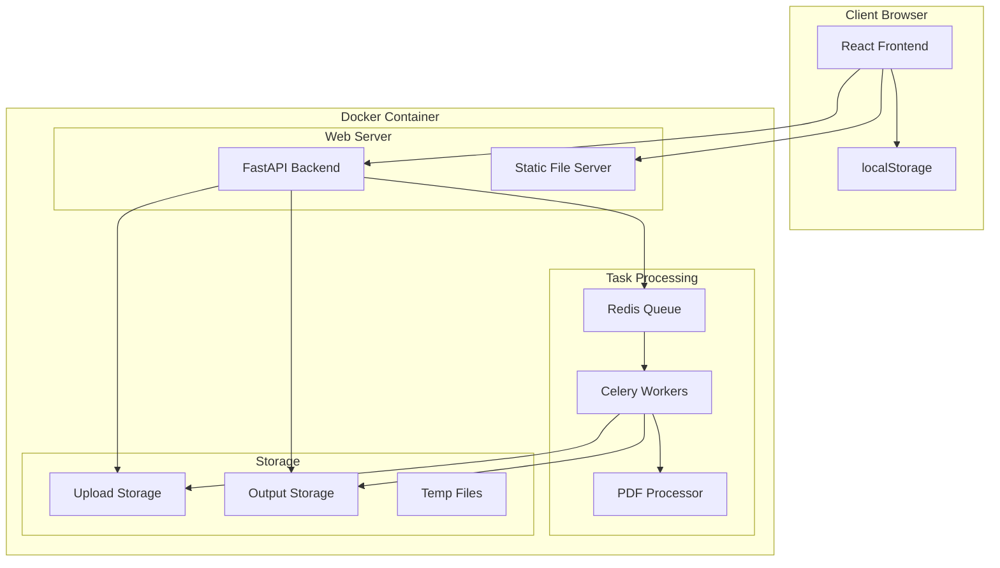

# Web Invoice Processor Design Document

## Overview

The Web Invoice Processor transforms the existing desktop PDF invoice layout application into a modern web-based service. The system uses a client-server architecture with a React frontend, FastAPI backend, Redis task queue, and Docker containerization. The design ensures multi-user support without authentication by using session-based isolation with localStorage for client-side state management.

## Architecture

### High-Level Architecture



### Technology Stack

- **Frontend**: React 18 with TypeScript, Tailwind CSS for styling
- **Backend**: FastAPI (Python) for REST API
- **Task Queue**: Redis + Celery for asynchronous processing
- **File Storage**: Local filesystem with organized directory structure
- **Containerization**: Docker with multi-stage builds
- **PDF Processing**: Existing PyMuPDF-based processing logic (reused)

## Components and Interfaces

### Frontend Components

#### 1. App Component
- **Purpose**: Root component managing global state and routing
- **State**: Current session ID, active tasks, application settings
- **Interface**: Manages localStorage operations and session initialization

#### 2. FileUpload Component
- **Purpose**: Handles file selection, drag-and-drop, and upload progress
- **Props**: `onFilesSelected`, `acceptedTypes`, `maxFileSize`
- **Events**: File validation, upload progress, error handling

#### 3. TaskTracker Component
- **Purpose**: Displays task status, progress, and results
- **Props**: `taskId`, `sessionId`
- **State**: Task status, progress percentage, download links

#### 4. TaskHistory Component
- **Purpose**: Shows user's previous tasks from localStorage
- **State**: Task list, filtering options, cleanup controls
- **Interface**: CRUD operations on localStorage task data

### Backend API Endpoints

#### File Upload API
```typescript
POST /api/upload
Content-Type: multipart/form-data
Headers: X-Session-ID: string

Request: FormData with files
Response: {
  taskId: string,
  status: "queued",
  message: string
}
```

#### Task Status API
```typescript
GET /api/task/{taskId}/status
Headers: X-Session-ID: string

Response: {
  taskId: string,
  status: "queued" | "processing" | "completed" | "failed",
  progress: number,
  message?: string,
  downloadUrls?: string[],
  createdAt: string,
  completedAt?: string
}
```

#### File Download API
```typescript
GET /api/download/{taskId}/{filename}
Headers: X-Session-ID: string

Response: File stream with appropriate headers
```

### Task Processing Components

#### 1. Task Queue Manager
- **Purpose**: Manages Redis-based task queue operations
- **Interface**: 
  ```python
  class TaskQueueManager:
      def enqueue_task(self, task_id: str, session_id: str, files: List[str]) -> bool
      def get_task_status(self, task_id: str) -> TaskStatus
      def update_task_progress(self, task_id: str, progress: int) -> None
  ```

#### 2. PDF Processing Worker
- **Purpose**: Celery worker that processes PDF files using existing logic
- **Interface**:
  ```python
  @celery.task
  def process_pdf_task(task_id: str, session_id: str, input_files: List[str]) -> Dict
  ```

#### 3. File Manager
- **Purpose**: Handles file storage, cleanup, and security
- **Interface**:
  ```python
  class FileManager:
      def store_upload(self, session_id: str, task_id: str, file: UploadFile) -> str
      def get_output_path(self, task_id: str) -> str
      def cleanup_old_files(self, max_age_hours: int = 24) -> int
      def verify_file_access(self, session_id: str, task_id: str) -> bool
  ```

## Data Models

### Task Model
```python
from pydantic import BaseModel
from datetime import datetime
from enum import Enum

class TaskStatus(str, Enum):
    QUEUED = "queued"
    PROCESSING = "processing"
    COMPLETED = "completed"
    FAILED = "failed"
    EXPIRED = "expired"

class Task(BaseModel):
    task_id: str
    session_id: str
    status: TaskStatus
    progress: int = 0
    input_files: List[str]
    output_files: List[str] = []
    error_message: Optional[str] = None
    created_at: datetime
    updated_at: datetime
    completed_at: Optional[datetime] = None
```

### Session Model
```python
class Session(BaseModel):
    session_id: str
    created_at: datetime
    last_activity: datetime
    task_count: int = 0
```

### File Upload Model
```python
class FileUpload(BaseModel):
    filename: str
    size: int
    content_type: str
    task_id: str
    session_id: str
    upload_path: str
```

## Correctness Properties

*A property is a characteristic or behavior that should hold true across all valid executions of a system-essentially, a formal statement about what the system should do. Properties serve as the bridge between human-readable specifications and machine-verifiable correctness guarantees.*

<function_calls>
<invoke name="prework">
<parameter name="featureName">web-invoice-processor

Property 1: File upload validation
*For any* uploaded file, if it is a valid PDF or ZIP file, then the upload endpoint should accept it and return a success response
**Validates: Requirements 1.2**

Property 2: Task ID uniqueness
*For any* concurrent file uploads, each upload should receive a unique Task_ID that differs from all other active Task_IDs
**Validates: Requirements 1.3**

Property 3: Task queue integration
*For any* file upload that completes successfully, the system should create a corresponding task in the queue with the returned Task_ID
**Validates: Requirements 1.4**

Property 4: Task status retrieval
*For any* valid Task_ID, querying the status endpoint should return the current task information associated with that ID
**Validates: Requirements 1.5**

Property 5: Invalid file rejection
*For any* file that is not a PDF or ZIP format, the upload endpoint should reject it and return an appropriate error message
**Validates: Requirements 2.3**

Property 6: File size validation
*For any* file that exceeds the configured size limit, the upload should be rejected with a size limit error
**Validates: Requirements 2.4**

Property 7: Batch processing consistency
*For any* multi-file upload, all files in the batch should be associated with the same Task_ID
**Validates: Requirements 2.5**

Property 8: UUID format compliance
*For any* generated Task_ID, it should be a valid UUID format and unique across all tasks
**Validates: Requirements 3.1**

Property 9: Task isolation
*For any* Task_ID query, the system should return only data associated with that specific task and session
**Validates: Requirements 3.4**

Property 10: Non-existent task handling
*For any* Task_ID that does not exist in the system, status queries should return an appropriate "not found" error
**Validates: Requirements 3.5**

Property 11: Status transition consistency
*For any* task that begins processing, its status should transition from "queued" to "processing"
**Validates: Requirements 4.1**

Property 12: Progress value validity
*For any* task in progress, the progress percentage should be between 0 and 100 and should not decrease
**Validates: Requirements 4.2**

Property 13: Completion state consistency
*For any* task that completes successfully, its status should be "completed" and it should have valid download URLs
**Validates: Requirements 4.3**

Property 14: Failure state handling
*For any* task that encounters an error, its status should be "failed" and it should include error details
**Validates: Requirements 4.4**

Property 15: Configuration responsiveness
*For any* environment variable changes, the system configuration should reflect those changes appropriately
**Validates: Requirements 5.5**

Property 16: Session association
*For any* task submitted by a user, it should be associated with that user's session identifier
**Validates: Requirements 6.2**

Property 17: Session isolation
*For any* user session, task queries should return only tasks associated with that specific session
**Validates: Requirements 6.3**

Property 18: Concurrent session isolation
*For any* multiple concurrent user sessions, each session should only access its own tasks without cross-contamination
**Validates: Requirements 6.5**

Property 19: Download URL generation
*For any* completed task, the system should generate secure, time-limited download URLs for all output files
**Validates: Requirements 7.1**

Property 20: File serving correctness
*For any* valid download request, the system should serve the correct file with appropriate HTTP headers
**Validates: Requirements 7.2**

Property 21: Download access control
*For any* download URL access, the system should verify that the requesting session owns the associated task
**Validates: Requirements 7.3**

Property 22: URL expiration handling
*For any* expired download URL, access attempts should return appropriate error responses
**Validates: Requirements 7.4**

Property 23: Automatic cleanup
*For any* task older than 24 hours, the cleanup process should automatically remove all associated files
**Validates: Requirements 8.1**

Property 24: Complete file removal
*For any* cleanup operation, both input and output files should be removed from storage
**Validates: Requirements 8.2**

Property 25: Cleanup status updates
*For any* task that undergoes cleanup, its status should be updated to indicate files are no longer available
**Validates: Requirements 8.3**

Property 26: Processing algorithm consistency
*For any* PDF file processed by the web application, the output should be identical to processing the same file with the desktop version
**Validates: Requirements 9.1**

Property 27: ZIP processing behavior
*For any* ZIP archive uploaded, the system should extract and process only PDF files while ignoring OFD and other file types
**Validates: Requirements 9.2**

Property 28: Layout specification compliance
*For any* processed PDF output, the layout should conform to the 2x4 grid specification with correct spacing and sizing
**Validates: Requirements 9.3**

## Error Handling

### Client-Side Error Handling
- **Network Errors**: Retry mechanism with exponential backoff for API calls
- **File Validation**: Real-time validation feedback during file selection
- **Session Recovery**: Automatic session restoration from localStorage on page reload
- **Upload Failures**: Progress indication and retry options for failed uploads

### Server-Side Error Handling
- **File Processing Errors**: Detailed error logging and user-friendly error messages
- **Storage Errors**: Graceful degradation when storage is unavailable
- **Queue Failures**: Dead letter queue for failed tasks with retry mechanisms
- **Resource Limits**: Proper HTTP status codes and rate limiting

### Error Response Format
```json
{
  "error": true,
  "code": "UPLOAD_SIZE_EXCEEDED",
  "message": "File size exceeds maximum limit of 50MB",
  "details": {
    "maxSize": 52428800,
    "actualSize": 104857600
  }
}
```

## Testing Strategy

### Unit Testing
- **Backend API**: Test all endpoints with various input scenarios
- **File Processing**: Test PDF processing logic with sample files
- **Task Queue**: Test queue operations and worker functionality
- **Session Management**: Test session creation, isolation, and cleanup

### Property-Based Testing
The system will use **Hypothesis** for Python property-based testing to verify the correctness properties defined above. Each property will be implemented as a separate test that generates random inputs and verifies the expected behavior holds across all test cases.

**Configuration**: Each property-based test will run a minimum of 100 iterations to ensure thorough coverage of the input space.

**Test Tagging**: Each property-based test will include a comment with the format: `**Feature: web-invoice-processor, Property {number}: {property_text}**`

### Integration Testing
- **End-to-End Workflows**: Test complete user journeys from upload to download
- **Multi-User Scenarios**: Test concurrent user sessions and task isolation
- **Docker Container**: Test containerized deployment and configuration
- **File Cleanup**: Test automatic cleanup processes and storage management

### Performance Testing
- **Concurrent Users**: Test system behavior under multiple simultaneous users
- **Large File Handling**: Test processing of maximum-sized files and batches
- **Memory Usage**: Monitor memory consumption during processing
- **Response Times**: Verify API response times meet requirements

## Security Considerations

### Session Security
- **Session ID Generation**: Cryptographically secure random session identifiers
- **Session Isolation**: Strict enforcement of session-based access control
- **No Persistent Storage**: Session data only stored in browser localStorage

### File Security
- **Upload Validation**: Strict file type and size validation
- **Path Traversal Prevention**: Sanitized file paths and names
- **Temporary File Cleanup**: Automatic cleanup of all temporary files
- **Download Authorization**: Session-based authorization for file downloads

### API Security
- **Input Validation**: Comprehensive validation of all API inputs
- **Rate Limiting**: Protection against abuse and DoS attacks
- **CORS Configuration**: Proper cross-origin resource sharing setup
- **Error Information**: Limited error information to prevent information disclosure

## Deployment Configuration

### Docker Configuration
```dockerfile
FROM python:3.11-slim

# Install system dependencies
RUN apt-get update && apt-get install -y \
    redis-server \
    && rm -rf /var/lib/apt/lists/*

# Set working directory
WORKDIR /app

# Copy requirements and install Python dependencies
COPY requirements.txt .
RUN pip install --no-cache-dir -r requirements.txt

# Copy application code
COPY . .

# Create storage directories
RUN mkdir -p /app/storage/uploads /app/storage/outputs /app/storage/temp

# Expose port
EXPOSE 8000

# Start services
CMD ["./start.sh"]
```

### Environment Variables
- `PORT`: Web server port (default: 8000)
- `REDIS_URL`: Redis connection URL (default: redis://localhost:6379)
- `STORAGE_PATH`: Base path for file storage (default: /app/storage)
- `MAX_FILE_SIZE`: Maximum upload file size in bytes (default: 52428800)
- `CLEANUP_INTERVAL`: File cleanup interval in hours (default: 24)
- `MAX_CONCURRENT_TASKS`: Maximum concurrent processing tasks (default: 4)

### Scaling Considerations
- **Horizontal Scaling**: Multiple container instances sharing Redis queue
- **Load Balancing**: Nginx or similar for load distribution
- **Shared Storage**: Network-attached storage for multi-instance deployments
- **Queue Scaling**: Separate worker containers for processing tasks