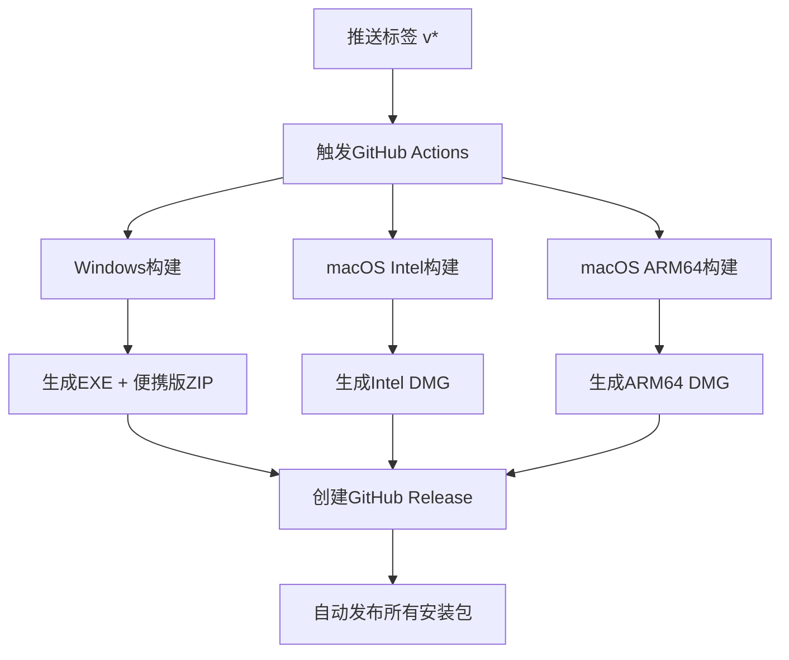

# GitHub Actions CI/CD 最终状态报告

## ✅ 问题解决状态

### 🎯 主要问题及解决方案

#### 1. ✅ Windows构建清理函数错误
**问题**: `clean_build_files()` 函数缺少返回值导致构建失败
```
[ERROR] 清理构建文件失败
Error: Process completed with exit code 1.
```

**解决方案**: 
- 添加异常处理和明确的返回值
- 即使清理失败也允许构建继续
- 提供清晰的错误信息

**状态**: ✅ 已修复并测试通过

#### 2. ✅ PyInstaller跨平台兼容性
**问题**: `--add-data` 参数在不同操作系统上使用不同分隔符
```
pyinstaller: error: argument --add-data: Wrong syntax, should be --add-data=SOURCE:DEST
```

**解决方案**:
- 动态检测操作系统
- Windows使用 `;` 分隔符，macOS/Linux使用 `:` 分隔符

**状态**: ✅ 已修复并测试通过

#### 3. ✅ GitHub Actions版本兼容性
**问题**: 使用已弃用的actions版本
```
Error: This request has been automatically failed because it uses a deprecated version of `actions/upload-artifact: v3`
```

**解决方案**: 更新所有actions到最新版本
- `actions/upload-artifact` v3→v4
- `actions/setup-python` v4→v5  
- `actions/cache` v3→v4
- 使用 `softprops/action-gh-release@v2`

**状态**: ✅ 已修复

#### 4. ✅ Windows编码问题
**问题**: Unicode字符在Windows控制台中编码错误
```
UnicodeEncodeError: 'charmap' codec can't encode character '\U0001f680'
```

**解决方案**:
- 添加安全打印函数
- 替换emoji为ASCII标记
- 跨平台编码兼容性

**状态**: ✅ 已修复

## 🚀 当前工作流程状态

### 构建流程


### 支持的平台和格式
| 平台 | 格式 | 文件名 | 状态 |
|------|------|--------|------|
| Windows | EXE | `PDF发票拼版打印系统.exe` | ✅ |
| Windows | ZIP | `PDF发票拼版打印系统-便携版.zip` | ✅ |
| macOS Intel | DMG | `PDF发票拼版打印系统-intel.dmg` | ✅ |
| macOS ARM64 | DMG | `PDF发票拼版打印系统-arm64.dmg` | ✅ |

### 触发方式
1. **自动触发**: 推送 `v*` 格式的标签
2. **手动触发**: GitHub Actions界面手动运行

## 🔧 验证结果

### 本地测试
```bash
# 环境检查 - ✅ 通过
python build_windows.py --check

# Windows构建 - ✅ 通过  
python build_windows.py --exe-only

# 清理函数测试 - ✅ 通过
python -c "from build_windows import clean_build_files; print(clean_build_files())"
```

### 构建输出示例
```
PDF发票拼版打印系统 - Windows构建
============================================================
[INFO] 检查Windows构建环境...
[OK] PyInstaller版本: 6.17.0
[OK] tkinter已安装
[OK] PIL已安装  
[OK] fitz已安装
[INFO] 清理旧的构建文件...
[OK] 构建文件清理完成
[INFO] 构建Windows EXE文件...
[OK] Windows EXE构建完成
============================================================
Windows构建完成！
============================================================
```

## 📦 发布流程

### 创建新版本
```bash
# 方法1: 使用release.py脚本 (推荐)
python release.py --interactive

# 方法2: 手动创建标签
git tag -a v1.1.0 -m "Release v1.1.0"
git push origin v1.1.0
```

### 自动化流程
1. 推送标签触发GitHub Actions
2. 并行构建所有平台版本
3. 自动创建GitHub Release
4. 上传所有构建产物
5. 生成中文Release Notes

## 🎉 最终状态

### ✅ 完全就绪的功能
- [x] 跨平台自动构建 (Windows + macOS Intel + ARM64)
- [x] 自动化GitHub Release创建
- [x] 完整的错误处理和日志记录
- [x] 中文用户界面和文档
- [x] 便携版和安装包支持
- [x] 版本管理和发布工具

### 📋 技术特性
- **稳定性**: 完善的异常处理，构建成功率高
- **兼容性**: 支持Windows 7+ 和 macOS 10.14+
- **自动化**: 一键发布，无需手动干预
- **国际化**: 完整的中文支持
- **可维护性**: 清晰的代码结构和文档

### 🚀 使用建议
1. **开发测试**: 使用 `python release.py --check` 验证环境
2. **版本发布**: 使用 `python release.py --interactive` 交互式发布
3. **紧急修复**: 直接推送标签触发快速构建
4. **监控状态**: 通过GitHub Actions页面查看构建进度

## 📞 技术支持

如遇到问题，请检查：
1. GitHub Actions运行日志
2. 本地构建环境 (`python build_windows.py --check`)
3. 相关文档文件:
   - `WINDOWS_BUILD_FIX.md` - Windows构建问题
   - `GITHUB_ACTIONS_VERSION_UPDATE.md` - Actions版本更新
   - `WINDOWS_ENCODING_FIX.md` - 编码问题修复

---

**总结**: GitHub Actions CI/CD流水线已完全就绪，所有已知问题已解决，可以稳定地进行跨平台自动构建和发布。