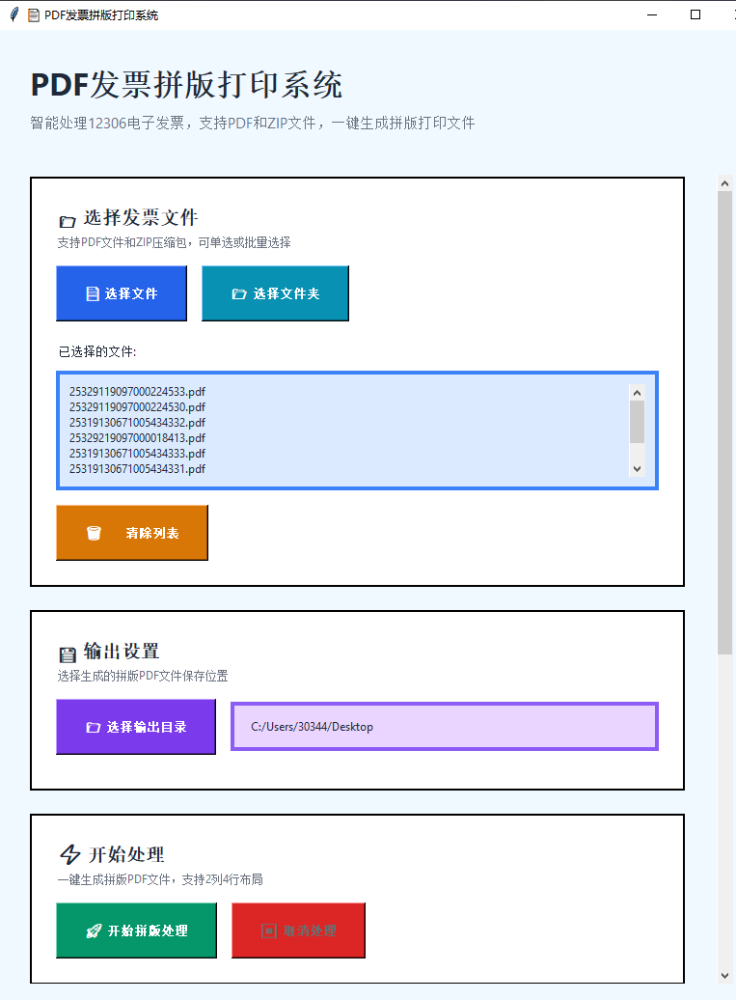
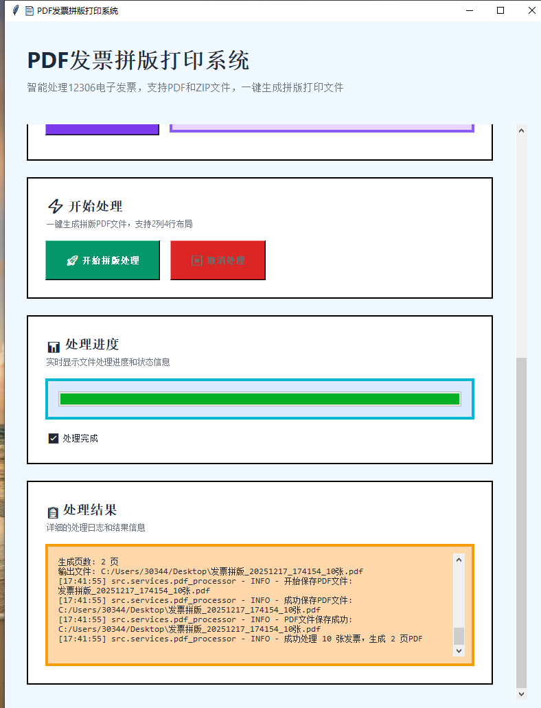

# PDF发票拼版打印系统

专门用于处理12306电子发票PDF文件的批量拼版打印工具。

## 📸 系统截图

### 主界面


### 处理界面


## 快速开始

### 使用预编译版本（推荐）

1. 从 [Releases](../../releases) 页面下载对应平台的安装包：
   - Windows: `invoice_pretty.exe` 或 `invoice_pretty_portable.zip`
   - macOS Intel: `invoice_pretty_intel.dmg`
   - macOS Apple Silicon: `invoice_pretty_arm64.dmg`

2. 解压到任意目录
3. 运行可执行文件即可使用

启动后您将看到如下界面：


### 从源代码运行

```bash
# 克隆项目
git clone <repository-url>
cd pdf-invoice-layout

# 自动安装
python install.py

# 或手动安装
pip install -r requirements.txt

# 运行程序
python main.py
```

## 系统要求

- **Python**: 3.8+ （源代码运行）
- **操作系统**: Windows 10+, macOS 10.14+, Linux (Ubuntu 18.04+)
- **内存**: 512MB+ （推荐2GB+）
- **磁盘空间**: 100MB+ （推荐500MB+）

## 项目结构

```
pdf-invoice-layout/
├── src/                    # 源代码目录
│   ├── __init__.py
│   ├── models/            # 数据模型
│   │   ├── __init__.py
│   │   └── data_models.py
│   ├── interfaces/        # 接口定义
│   │   ├── __init__.py
│   │   └── base_interfaces.py
│   ├── services/          # 业务逻辑服务
│   │   └── __init__.py
│   └── ui/               # 用户界面
│       └── __init__.py
├── tests/                 # 测试目录
│   └── __init__.py
├── main.py               # 主入口文件
├── setup.py              # 安装配置
├── requirements.txt      # 依赖管理
└── README.md            # 项目说明
```

## 详细安装说明

请参考 [INSTALL.md](INSTALL.md) 获取完整的安装指南。

## 配置说明

请参考 [CONFIG.md](CONFIG.md) 了解配置选项。

## 使用方法

### 图形界面模式（默认）
```bash
python main.py
```

**注意**: 如果遇到 `No module named '_tkinter'` 错误，请参考下面的解决方案。

### 命令行模式

#### 方式1: 通过main.py
```bash
# 交互式命令行
python main.py --cli

# 直接处理文件
python main.py input.pdf -o output.pdf
python main.py input_folder/ -o output.pdf
```

#### 方式2: 使用简化命令行版本（推荐）
```bash
# 处理单个PDF文件
python cli_main.py input.pdf -o output.pdf

# 处理单个ZIP压缩包
python cli_main.py invoices.zip -o output.pdf

# 处理目录中的所有PDF和ZIP文件
python cli_main.py input_folder/ -o output.pdf

# 启用调试模式
python cli_main.py input.pdf -o output.pdf --debug
```

### 调试模式
```bash
python main.py --debug
python cli_main.py input.pdf --debug
```

### 自定义配置
```bash
python main.py --config my_config.json
```

## 常见问题

### tkinter未安装错误

如果遇到 `No module named '_tkinter'` 错误，有以下解决方案：

#### 解决方案1: 安装tkinter支持
```bash
# macOS (使用Homebrew)
brew install python-tk

# Ubuntu/Debian
sudo apt-get install python3-tk

# CentOS/RHEL
sudo yum install tkinter
# 或
sudo dnf install python3-tkinter
```

#### 解决方案2: 使用命令行版本
无需GUI的情况下，可以直接使用命令行版本：
```bash
python cli_main.py input_files/ -o output.pdf
```

#### 解决方案3: 重新安装Python
确保安装Python时包含tkinter支持。

## ZIP压缩包支持

系统现在支持直接处理ZIP压缩包，这对于12306下载的发票文件特别有用：

### 支持的文件格式
- **PDF文件**: 直接处理
- **ZIP压缩包**: 自动解压并提取其中的PDF文件
- **混合目录**: 同时包含PDF文件和ZIP压缩包的目录

### ZIP处理特性
- 自动识别并解压ZIP文件
- 只提取PDF文件，自动忽略OFD等其他格式
- 支持嵌套目录结构
- 自动清理临时解压文件
- 详细的处理日志

### 使用示例
```bash
# 处理单个ZIP文件
python cli_main.py invoices.zip -o result.pdf

# 处理包含多个ZIP文件的目录
python cli_main.py download_folder/ -o combined.pdf

# GUI模式也支持选择ZIP文件
python main.py
```

## 核心组件

### 数据模型
- `PDFDocument`: PDF文档数据模型
- `LayoutConfig`: 布局配置数据模型  
- `PositionedInvoice`: 定位后的发票数据模型
- `ProcessResult`: 处理结果数据模型

### 接口定义
- `IFileHandler`: 文件处理接口
- `IPDFReader`: PDF读取接口
- `ILayoutManager`: 布局管理接口
- `IPDFProcessor`: PDF处理接口
- `IUIController`: 用户界面控制接口

## 🖼️ 界面预览

系统提供现代化的图形用户界面，操作简单直观：

| 主界面 | 处理界面 |
|--------|----------|
|  |  |

**主要界面功能**：
- 🎯 **文件选择**: 支持拖拽添加PDF文件和ZIP压缩包
- 📁 **批量处理**: 一次性处理多个发票文件
- ⚡ **实时进度**: 显示处理进度和详细日志
- 🎨 **现代设计**: 简洁美观的用户界面

## 功能特性

- 支持12306电子发票PDF文件批量处理
- **支持ZIP压缩包自动解压**，自动提取其中的PDF文件，忽略OFD等其他格式
- 2列4行A4纸张布局，每页最多8张发票
- 保持发票纵横比不变
- 300DPI或更高输出质量
- 简单易用的图形界面
- 详细的处理进度和错误反馈
- 跨平台支持（Windows, macOS, Linux）
- 灵活的配置管理
- 完整的错误处理和日志记录
- 自动临时文件清理

## 开发和构建

### 运行测试
```bash
# 运行所有测试
pytest tests/

# 运行兼容性测试
python test_compatibility.py

# 验证配置
python validate_config.py
```

### 构建可执行文件
```bash
# 自动构建
python build.py

# 手动构建
pyinstaller build.spec
```

### 代码质量检查
```bash
# 代码格式化
black src/ tests/

# 类型检查
mypy src/

# 测试覆盖率
pytest tests/ --cov=src
```

## 项目状态

- ✅ 核心功能实现
- ✅ 图形用户界面
- ✅ 配置管理系统
- ✅ 打包和分发
- ⏳ 命令行界面（计划中）
- ⏳ 属性测试（可选）

## 许可证

MIT License - 详见 LICENSE 文件

## 贡献

欢迎提交问题报告和功能请求。如需贡献代码，请先阅读开发指南。