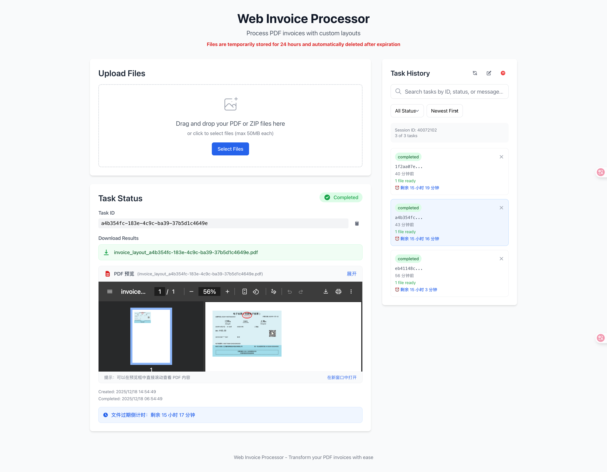

# Web Invoice Processor / Web发票处理器

一个基于Web的PDF发票布局处理器，将现有的桌面应用程序转换为可扩展的Web服务。

## 应用截图



*Web发票处理器的主界面，支持文件上传、实时处理状态跟踪和PDF预览功能*

## 项目结构

```
web-app/
├── backend/                 # FastAPI后端
│   ├── app/
│   │   ├── api/            # API路由
│   │   ├── core/           # 配置和工具
│   │   ├── models/         # 数据模型
│   │   └── services/       # 业务逻辑
│   ├── storage/            # 文件存储目录
│   └── requirements.txt    # Python依赖
├── frontend/               # React前端
│   ├── src/               # React源代码
│   ├── public/            # 静态资源
│   └── package.json       # Node.js依赖
├── scripts/               # 部署和管理脚本
├── docker-compose.yml     # 生产环境部署
├── docker-compose.https.yml # HTTPS生产环境部署
└── docker-compose.dev.yml # 开发环境部署
```

## 开发环境设置

### 后端设置

1. 进入后端目录：
   ```bash
   cd web-app/backend
   ```

2. 设置Python虚拟环境：
   ```bash
   ./setup_venv.sh
   ```

3. 激活虚拟环境：
   ```bash
   source venv/bin/activate
   ```

4. 复制环境配置：
   ```bash
   cp .env.example .env
   ```

5. 启动开发服务器：
   ```bash
   ./start_dev.sh
   ```

### 前端设置

1. 进入前端目录：
   ```bash
   cd web-app/frontend
   ```

2. 安装依赖：
   ```bash
   npm install
   ```

3. 启动开发服务器：
   ```bash
   npm start
   ```

### Docker开发环境

使用热重载的完整开发环境：

```bash
cd web-app
docker-compose -f docker-compose.dev.yml up
```

## 生产环境部署

### 快速部署（HTTP）

使用Docker构建和运行：

```bash
cd web-app
docker-compose up --build
```

### HTTPS部署（推荐）

#### 方式一：交互式设置（推荐）

```bash
cd web-app
./setup-https.sh
```

这个脚本会引导您完成配置并自动部署HTTPS。

#### 方式二：手动设置

1. **复制环境配置模板：**
   ```bash
   cp .env.https.example .env.https
   ```

2. **编辑配置文件：**
   ```bash
   nano .env.https
   ```
   
   必需设置：
   - `DOMAIN=your-domain.com` （您的域名）
   - `ACME_EMAIL=your-email@example.com` （Let's Encrypt邮箱）
   - `TRAEFIK_AUTH=admin:$2y$10$...` （使用 `./scripts/generate-auth.sh` 生成）

3. **生成认证字符串：**
   ```bash
   ./scripts/generate-auth.sh admin mypassword
   ```

4. **部署：**
   ```bash
   ./scripts/deploy-https.sh
   ```

### HTTPS部署特性

- **自动HTTPS证书**：使用Let's Encrypt自动获取和续期SSL证书
- **安全重定向**：所有HTTP流量自动重定向到HTTPS
- **安全头部**：包含HSTS、XSS保护等安全头部
- **仪表板保护**：Traefik仪表板使用基本认证保护
- **网络隔离**：服务在Docker网络中隔离运行
- **最小攻击面**：仅暴露80和443端口

### 证书管理

```bash
# 检查证书状态
./scripts/manage-certs.sh status

# 列出所有证书
./scripts/manage-certs.sh list

# 强制续期证书
./scripts/manage-certs.sh renew

# 备份证书
./scripts/manage-certs.sh backup

# 查看Traefik日志
./scripts/manage-certs.sh logs

# 检查端口可访问性
./scripts/check-ports.sh
```

### DNS配置要求

部署前确保您的域名指向服务器：

```bash
# 检查当前DNS
dig +short your-domain.com

# 应该返回您服务器的IP地址
curl ifconfig.me
```

两个命令应该返回相同的IP地址。

### 防火墙配置

确保以下端口开放：
- **端口80**（HTTP）：用于ACME验证和重定向
- **端口443**（HTTPS）：主要应用流量

```bash
# UFW (Ubuntu)
sudo ufw allow 80
sudo ufw allow 443

# iptables
sudo iptables -A INPUT -p tcp --dport 80 -j ACCEPT
sudo iptables -A INPUT -p tcp --dport 443 -j ACCEPT
```

## 服务访问

### 开发环境
- **前端**: http://localhost:3000
- **后端API**: http://localhost:8000
- **Redis**: localhost:6379

### 生产环境（HTTP）
- **应用**: http://localhost
- **API健康检查**: http://localhost/api/health

### 生产环境（HTTPS）
- **应用**: https://your-domain.com
- **API健康检查**: https://your-domain.com/api/health
- **Traefik仪表板**: https://traefik.your-domain.com

## 功能特性

- **Web文件上传界面**：支持拖拽上传和批量文件处理
- **异步PDF处理**：使用Celery进行后台任务处理
- **实时状态跟踪**：实时显示处理进度和状态
- **会话隔离**：基于会话的用户隔离机制
- **自动文件清理**：24小时后自动删除临时文件
- **PDF预览功能**：处理完成后可直接预览生成的PDF
- **倒计时显示**：显示文件过期剩余时间
- **Docker容器化**：完整的容器化部署方案
- **响应式设计**：使用Tailwind CSS的现代化界面
- **HTTPS支持**：自动SSL证书获取和续期
- **北京时间显示**：所有时间显示为北京时间

## 系统要求

- Python 3.11+
- Node.js 18+
- Redis
- Docker（用于容器化部署）
- 域名（用于HTTPS部署）

## 故障排除

### 常见问题

#### 1. 证书未签发
**症状**：HTTPS不工作，浏览器显示"不安全"

**解决方案**：
```bash
# 检查Traefik日志
docker-compose -f docker-compose.https.yml logs traefik

# 验证DNS
dig +short your-domain.com

# 检查端口80/443是否可访问
curl -I http://your-domain.com
```

#### 2. 域名无法访问
**症状**："无法访问此网站"

**解决方案**：
- 验证DNS配置
- 检查防火墙设置（端口80、443）
- 确保域名指向正确的IP

#### 3. Traefik仪表板无法访问
**症状**：404或认证问题

**解决方案**：
```bash
# 检查Traefik服务
docker-compose -f docker-compose.https.yml ps traefik

# 重新生成认证
./scripts/generate-auth.sh admin newpassword
```

### 测试环境

使用Let's Encrypt测试服务器进行测试：

```bash
./scripts/manage-certs.sh test
```

### 更新和维护

#### 更新应用

```bash
# 停止服务
docker-compose -f docker-compose.https.yml down

# 拉取更新
git pull origin main

# 重新构建和启动
docker-compose -f docker-compose.https.yml build --no-cache
docker-compose -f docker-compose.https.yml --env-file .env.https up -d
```

#### 备份策略

```bash
# 备份证书
./scripts/manage-certs.sh backup

# 备份应用数据
docker run --rm -v web-app_storage_data:/data -v $(pwd)/backups:/backup alpine tar czf /backup/storage-$(date +%Y%m%d).tar.gz -C /data .
```

## 相关文档

- [HTTPS部署详细指南](HTTPS.md)
- [生产环境部署指南](PRODUCTION.md)
- [快速开始指南](QUICKSTART.md)